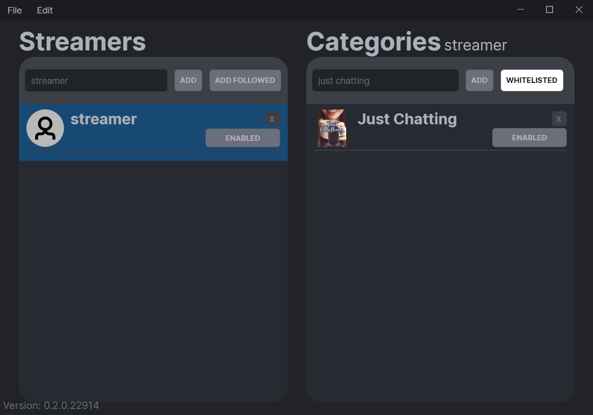
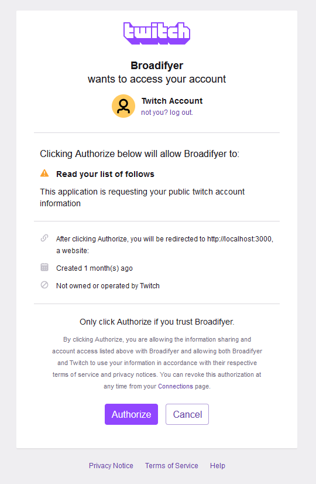
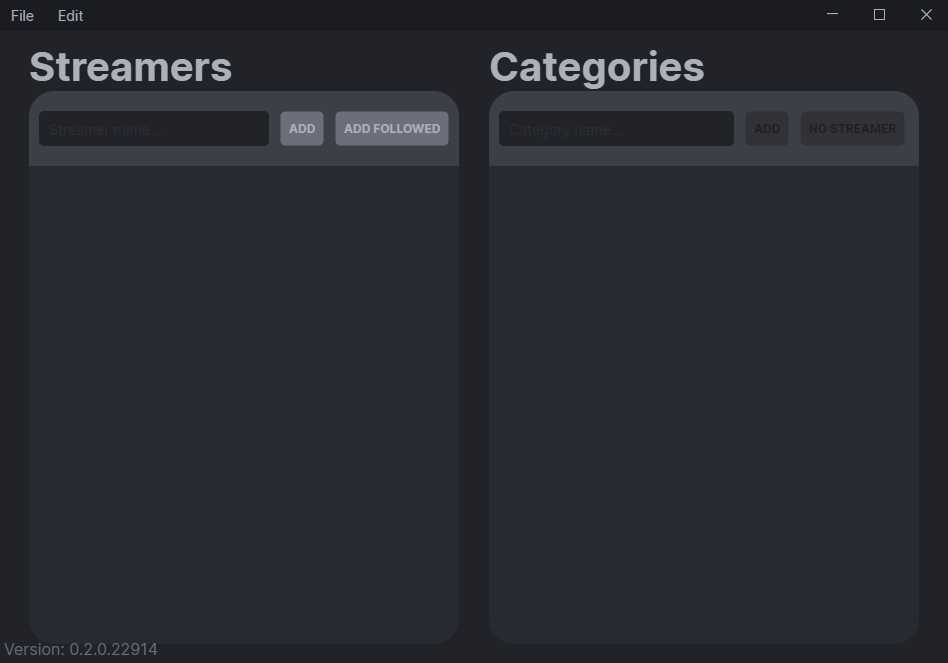
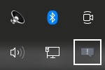

  <h1 align="center">Broadifyer</h1>
  

Table of contents

- [About](#about)
  - [Features](#features)
    - [Going live notifications](#going-live-notifications)
    - [Category filters](#category-filters)
    - [Urgent notifications](#urgent-notifications)
  - [Built With](#built-with)
  - [Getting Started](#getting-started)
    - [Reconfiguring or exiting the application](#reconfiguring-or-exiting-the-application)
    - [Run on startup](#run-on-startup)
    - [Recieve notifications whilst in fullscreen](#recieve-notifications-whilst-in-fullscreen)
    - [Export / Import configuration](#export--import-configuration)
  - [Building](#building)
  - [License](#license)

# About

Broadifyer is a notification app that brings Twitch notifications into the windows notification ecosystem. Recieve going live notifications from any streamer any time, optionally even whilst in [full screen apps](#recieve-notifications-whilst-in-fullscreen). Additional category filters can also be used, to only be notified about the most relevant streams.

## Features

### Going live notifications

Add any streamer you want to be notified about when the streamer is going live.

### Category filters

Use category filters when you only want to watch a specific streamer stream specific categories.

### Urgent notifications

Optionally mark the notifications as urgent, which allows them to show up any time, event when in fullscreen mode.
See [here](#recieve-notifications-whilst-in-fullscreen) for how to enable.

## Built With

- [TwitchLib](https://github.com/TwitchLib/TwitchLib) (twitch api requests)
- [Avalonia](https://www.avaloniaui.net/) (user interface)
- [Json.NET](https://www.newtonsoft.com/json) (json file parsing)

<a href="#top">(back to top)</a>

## Getting Started

- Download the [latest release](https://github.com/karstensensensen/Broadifyer/releases/latest).
- Run the program.
- Log in to twitch account in opened browser.
- Allow  Broadifyer access.

- Add desired streamers and categories by their name.

- Close window and wait for streamer to go live.

---

### Reconfiguring or exiting the application

Broadifyer will run in the background, and can be accessed via its tray icon.

- Right click the tray icon.
- Select 'Exit' to stop the application, or 'Edit' to access the configuration window.

---

### Run on startup
The 'Run on startup' setting can be enabled with the settings window.

- Follow the [Reconfiguring or exiting the application](#reconfiguring-or-exiting-the-application) guide, to open the configuration window.
- Expand the 'Edit' menu.
- Select 'Settings', to open the settings window.
- Enable the 'Run on startup' setting.
- Close the configuration window.

Many other relevant settings can be configured in this window.

---

### Recieve notifications whilst in fullscreen

- [Open](#reconfiguring-or-exiting-the-application) the settings window.
- Toggle the 'Urgent Notification' setting

This marks all notifications sent from the application, as improtant, which allows them to show up, event when in fullscreen mode.

---

### Export / Import configuration

- [Open](#reconfiguring-or-exiting-the-application) the configuration window.
- Select the 'File' menu.
- Select 'Export' or 'Import' to save or load the current configuration.

---

## Building

- Open Broadifyer.sln, using Visual studio (developed with vs 2022)
- Build the Broadifyer.csproj in any configuration.
- Done!

<a href="#top">(back to top)</a>

## License

Distributed under the MIT License. See `LICENSE` for more information.

<a href="#top">(back to top)</a>

[AuthImage]: https://github.com/karstensensensen/AsciiRenderer/blob/main/assets/auth_img.png
[UsageExample]: https://github.com/karstensensensen/AsciiRenderer/blob/main/assets/usage_example.gif
[TrayIcon]: https://github.com/karstensensensen/AsciiRenderer/blob/main/assets/tray_location.png